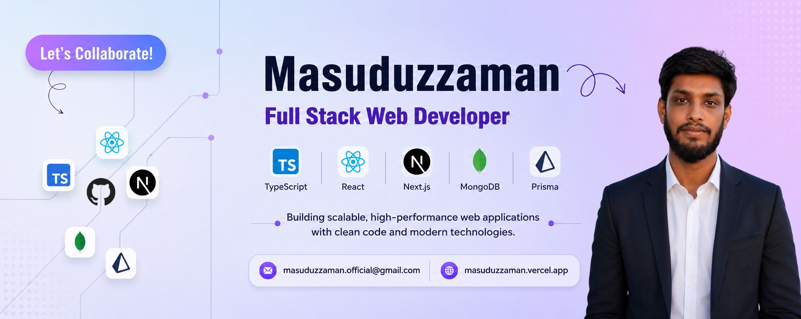

  <h1>Hi 👋, I'm Touhidur Zaman</h1>
  <h3>Passionate Full Stack Web Developer</h3>

 

- 👋 Hi, I'm [@masuduz-zaman](https://github.com/masuduz-zaman)
- 💻 I'm currently working on **React.js, Next.js, Typescript and Redux** for frontend development.
- 🔮 Using **Node.js, Express.js, MongoDB, Mongoos** for the backend.
- 🚀 I'm currently learning **PostgreSQL, and Prisma**.
- 💬 Ask me about **Full-Stack (React, Next, Node, Express, MongoDB, PostgreSQL)**.
- 🌐 Explore My Portfolio [masuduzzaman](https://masuduzzaman.vercel.app)
- 📫 Feel free to reach me out [Email](masuduzzaman.officials@gmail.com)

## ⚙️ TECHNOLOGY STACK:

### Languages:

  

### JavaScript Frameworks & Libraries:

  
  
  

### Database & Model:

  

### Deployment Platform:

  

### Design & Graphics:

  

### Tools & Technologies:

  

